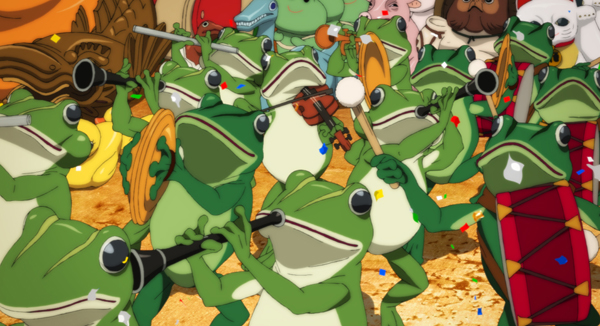
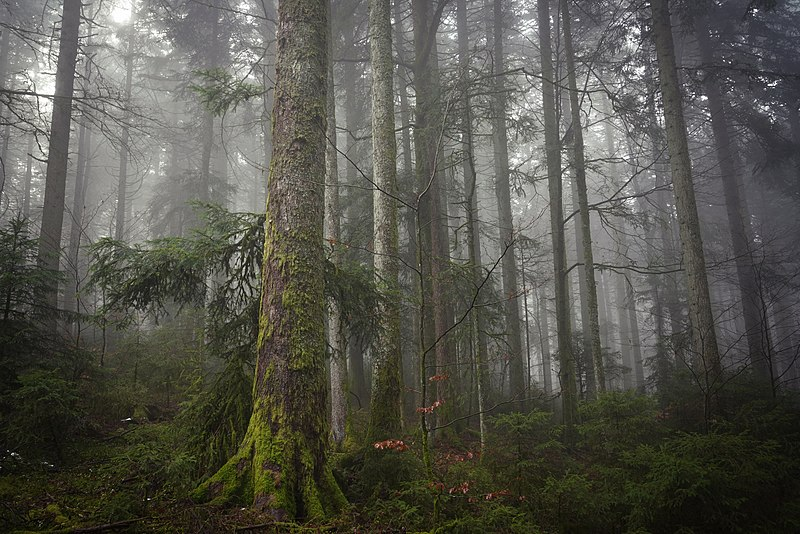
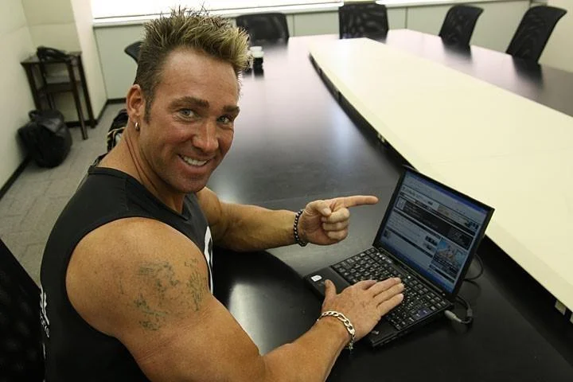
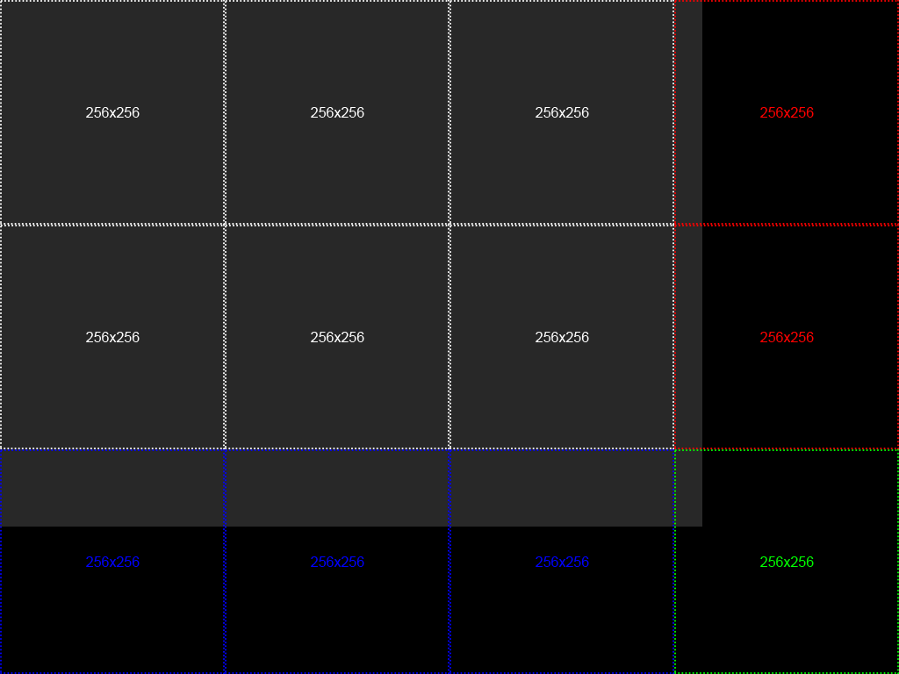
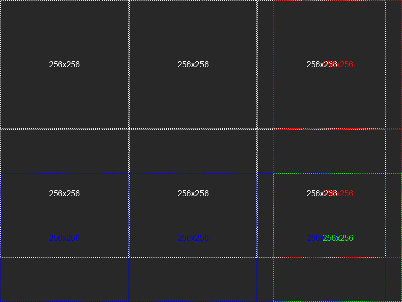

<h1 align="center">Stable Diffusion Upscaler</h2>

Python script to scale images beyond 512x512 by x4 using the [Stable Diffusion x4 upscaler model card](https://huggingface.co/stabilityai/stable-diffusion-x4-upscaler) with image segmentation.

## Key Features
- cuts images into segments of 64, 128, 256 or 512 pixels
- merges scaled segments into final image
- can specify noise level, seed and inference steps per segment
- ["crop" and "overlay"](#segmentation-type) segmentation/merging strategies

# Installation
```
pip install -r requirements.txt
```

Tested with Python 3.10.8

# Usage

To scale an image with a `noise_level` of 5 with 20 `steps` for scaling:
```
python .\scale.py -i image.png -v -s 20 -n 5 -o scaled.png
```

**NOTE:** Scaling tends to work best segments sized 128 or 256, 64 tends to give poor results and often deforms the scaled image, 512 tends to give diminishing returns from scaling.

# Comparisons
### Paprika Frogs



### Forest



### Thinkpad



---

# Segmentation Type
"crop" will fill any overflow with black pixels, scale them and finally crop them from the final image:

**NOTE:** this can affect scaling deforming 

"overlay" will overlay segments that would otherwise extend over the images original resolution:


# Tips and other Information
it's common for some segments to deform and lose their colour when being scaled up, if you encounter any "garbage" segments try again with another seed, lower inference step count or change the segment size.

Additionally, since segments are scaled properly it possible for some pixels to be misaligned creating a "tearing" like effect. This is mostly noticeable when zoomed in.